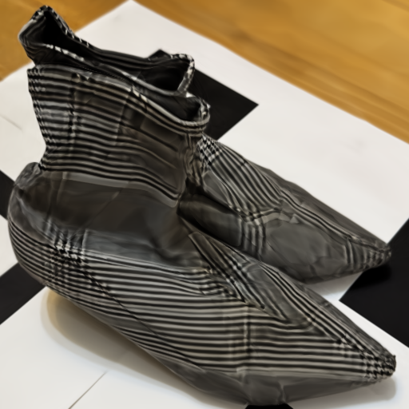

# nerf-2d-space

This repository contains an implementation of NeRF operating directly in image space. Of course, this version is not intended for 3D reconstruction. Instead, it was created to demonstrate the effectiveness of **positional encoding**.

One of the key innovations in NeRF is its use of positional encoding, which maps coordinates into a high-frequency space using sinusoidal functions. Simply feeding raw coordinates into an MLP often fails to capture fine details in the scene. This is because MLPs tend to produce similar outputs for nearby inputs. By encoding the input coordinates with high-frequency functions, NeRF overcomes this limitation and preserves more detail.

## Video
<video src="https://github.com/user-attachments/assets/662f8d41-5ada-41bc-8c46-02aead7214c8" controls="true" loop="true" autoplay="true" muted width="512"></video>
<!-- https://github.com/user-attachments/assets/662f8d41-5ada-41bc-8c46-02aead7214c8 -->
The video above shows the output images during training **with positional encoding**. Training was conducted for 3,000 iterations.

## Comparison
### Ground Truth Image

### Without Positional Encoding (10,000 iterations)

Lacking high-frequency parts.

### With Positional Encoding (3,000 iterations)

Preserving high-frequency parts.
